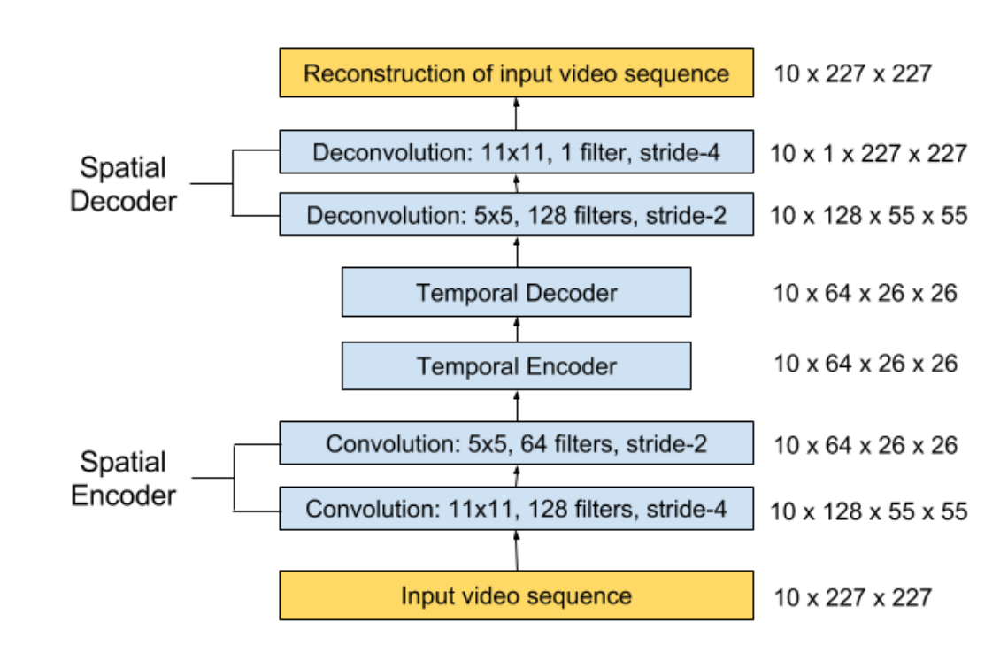
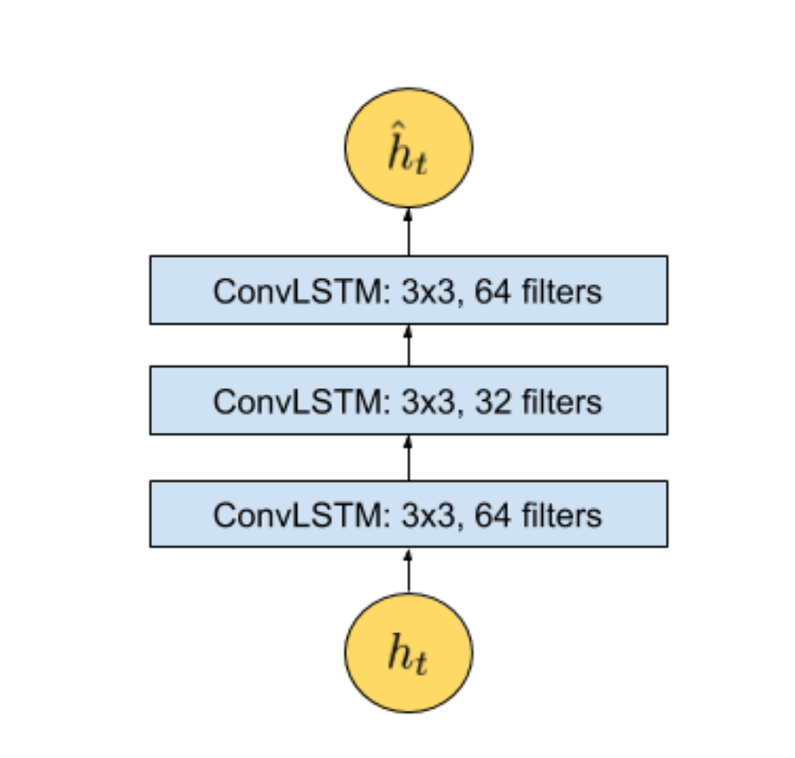

# Abnormal Event Detection in Videos using Spatiotemporal Autoencoder using Spatiotemporal Autoencoder
Paper Link : [LINK](https://arxiv.org/pdf/1701.01546.pdf)

### Abstract 
Video내에서 이상치를 탐색하는 방식들을 제안
이전까지는 hand-crafted Feature을 필요로 했음. 이후에 CNN이 등장했지만 해당 방식 또한 Supervised거나 Learning signal로 label을 필요로함
해당 논문의 저자는 Spatio-Temporal Architecture을 제안하는데, 해당 논문은 다음과 같은 2가지 특징을 지니고 있음
- Spatial Feature Representation
- learning the temporal evolution of the spatial Features.

Experiment Dataset : ```Avenue, Subway and UCSD benchmark```


### Introduction
video data의 급작스러운 성장과 함께 비디오 내의 objects, object의 행동들을 인지하는것 뿐만 아니라 평소에 발생하지 않는 특이한 객체나 행동을 탐지하는것이 중요해졌음.
비디오 내에서 이러한 이상치를 발견하는것이 Automatic quality control 부터 Visual surveillance까지 다양한 애플리케이션에서 중요하게 여겨짐.

이상치 탐지에서 중요하게 여겨지는 개념은 "이상치는 결국 낮은 확률로 발생한다는 것" 이다.

Video data에서는 다음과 같은 문제점들로 인해 모델링하는데 어려움이 있음
- High dimension-ality
- noise
- huge variety of events and interactions

Anomalies는 highly contextual한데, 예를들어 레스토랑에서 뛰는것은 anomaly하지만 공원에서 뛰는것은 normal하다.
또한 anomaly하다는것은 결과적으로 정의하기가 애매하다는 문제가 있다. (지하철 플랫폼에서 걷는것은 평범할 수도있지만 누군가에게는 의심쩍을수도 있듯이)

해당 논문의 저자들은 Domain-Free 방식을 제안했는데 당므과 같다.
- 추가적인 사람의 노력을 요구하지 않음
- 쉽게 다른 scene들에 적용할 수 있음


### Methodology
- End-to-End model로 Encoder-Decoder 구조를 이용함
  - 해당 방식은 Spatial feature extractor , temporal encoder-decoder를 포함하는데 input volume of frames의 temporal patterns을 학습할 수 있게함
- 해당 기법을 통해서 normal Data로만 학습을 해서 Reconstruction Error를 줄임
  - 만약 이후에 Anomaly Data가 들어온다면 Reconstruction Error가 커질것이고, 이 Reconstruction Error가 커진다면 해당 데이터는 Anomaly하다는것을 가정


### Architecture
<p>
  
</p>

- ### Input Data
  - Each Frame들은 raw video로부터 extracted되어지고, 227 x 227 크기로 Resize
  - Pixel value를 [0,1]로 Normalization
  - dimensionality를 줄이기위해서 grayscale로 Convert 후 zero mean, unit variance
  - model의 Input은 video volumn이기 때문에 비디오 전체를 넣을 수는 없으므로 skipping stride를 통해서 10개의 연속적인 프레임으로 입력을 넣는다.
  - ex) stride-1,2,3이 가능한데 {1,2,3,4,5,6,7,8,9,10} ,{1,3,5,7,9,11,13...} , {1,4,7,10...}으로 이루어짐
 
- ### Feature Learning
  - ```Convolutional Spatiotemporal Autoencoder``` Architecture
  - Spatial (Encoder,Decoder) : 2-Convolutional, Deconvolutional layers
  - Temporal Encoder : 3-layers convolutional LSTM model

<p>
  
</p>


- 각각의 Temporal Encoder, Decoder는 다음과 같이 3개의 ConvLSTM 구조를 이루고 있음


### Regularity Score (Metric)

- 해당 논문의 저자는 모델의 성능을 평가하기 위해서 ```Regularity Score```
- 결론적으로 Anomaly Detection에서는 Anomaly를 잘 탐지하는것도 중요하지만 False Positive의 양을 줄이는것이 매우 중요하다
- Frame t번째의 video sequence에서 Pixel값 I의 Reconstruction Error는 (Input Frame, Reconstructed Frame)사이의 유클리디안 거리로 측정한다.

$$e(t) = ||x_(t) - f_W{x(t))||_2$$

- $f_W$ : learned weightes by the spatio-temporal model
- 위의 연산을 통해서 나온 e(t)를 이용하여 ```Abnormality score``` $s_a(t)$를 [0,1] 사이 값으로 scaling 해서 계산.
$$e(t) = \|x_{(t)} - f_W(x(t))\|_2$$
  

$$s_r(t) = 1 - s_a(t)$$
